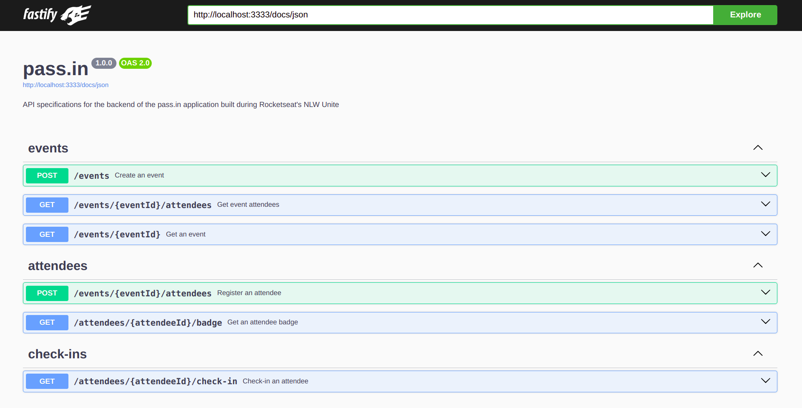
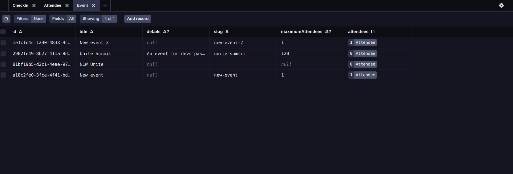

  <a href="#-technologies">Technologies</a>&nbsp;&nbsp;&nbsp;|&nbsp;&nbsp;&nbsp;
  <a href="#-project">Project</a>&nbsp;&nbsp;&nbsp;|&nbsp;&nbsp;&nbsp;
  <a href="#-how-to-run">How to run</a>&nbsp;&nbsp;&nbsp;|&nbsp;&nbsp;&nbsp;
  <a href="#-how-to-contribute">How to contribute</a>&nbsp;&nbsp;&nbsp;

 

# NLW Unite

## 🚀 Technologies

This project was developed with the following technologies:

- [Node.js](https://nodejs.org/en/) - v22.4.0
- [Npm](https://www.npmjs.com/) - 10.8.1
- [TypeScript](https://www.typescriptlang.org/) - ^5.5.3
- [Prisma](https://www.prisma.io/docs) - ^5.16.1
- [Fastify](https://www.fastify.io/) - ^4.28.1
- [Fastify Swagger](https://github.com/fastify/fastify-swagger) - ^8.14.0
- [Fastify Swagger-UI](https://github.com/fastify/fastify-swagger-ui) - ^4.0.0
- [Fastify Cors](https://github.com/fastify/fastify-cors) - ^9.0.1
- [Zod](https://zod.dev/) - ^3.23.8
- [tsup](https://www.npmjs.com/package/tsup) - ^8.1.0

## 💻 Project

pass.in is an application for managing participants in in-person events.

The tool allows the organizer to register an event and open a public registration page.

Registered participants can issue a credential for check-in on the day of the event.

The system will scan the participant's credentials to allow entry to the event.

NLW event on the [Rocketseat](https://www.rocketseat.com.br/) platform.

- [Front-end - Web](https://github.com/leticea/nlw-unite-react)

  

  

## ⚙️ How to run

- Clone the project.
- Go to the project folder and run 'npm install' (use 'yarn install' if that's your configuration).
- npm run dev to run the project on the indicated port.
- npx prisma studio (to view the database).
- API specifications runs on the path http://localhost:3333/docs

## 🤔 How to contribute

- Fork this repository;
- Create a branch with your feature: `git checkout -b my-feature`;
- Commit your changes: `git commit -m 'feat: My new feature'`;
- Push to your branch: `git push origin my-feature`.

After your pull request is merged, you can delete your branch.

## 📝 License

This project is under the MIT license.
